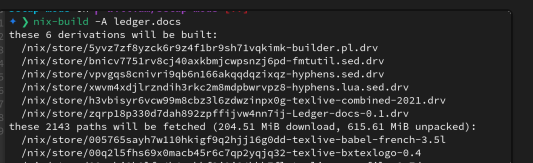
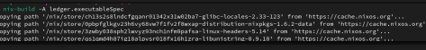

# Formal ledger specifications

This repository contains the formal ledger specifications that are intended to eventually replace the existing formal specifications of the Cardano ledger found [here](https://github.com/input-output-hk/cardano-ledger). This project is currently incomplete and work in progress.

This repository currently contains two specifications---the work in progress specification for Cardano (up to and including the Conway era) and a small example that was produced for the Midnight project (but is unrelated to any actual Midnight code/features). Each specification is executable and contains some documentation in the form of a PDF document. They can be built by following the steps below.

--------------------

## Building and Testing the Formal Specification

Clone this repository and enter its directory.

```
git clone https://github.com/input-output-hk/formal-ledger-specifications.git
cd formal-ledger-specifications
```


### Building the spec using nix-build

Build the specification and documentation. (This could take a long time.)

```
nix-build -A ledger.executableSpec
```



Build the spec docs.

```
nix-build -A ledger.docs
```


Build the Midnight example and its docs.

```
nix-build -A midnight.executableSpec
nix-build -A midnight.docs
```

----------------------------------

### Test the spec using nix-shell


The `executableSpec` is a `cabal` package, which can be loaded into GHCI like this:

```
nix-shell --command "cabal repl --build-depends 'agda-ledger-executable-spec, agda-ledger-executable-spec-midnight'"
λ> :m HSLedgerTest
λ> main
```
